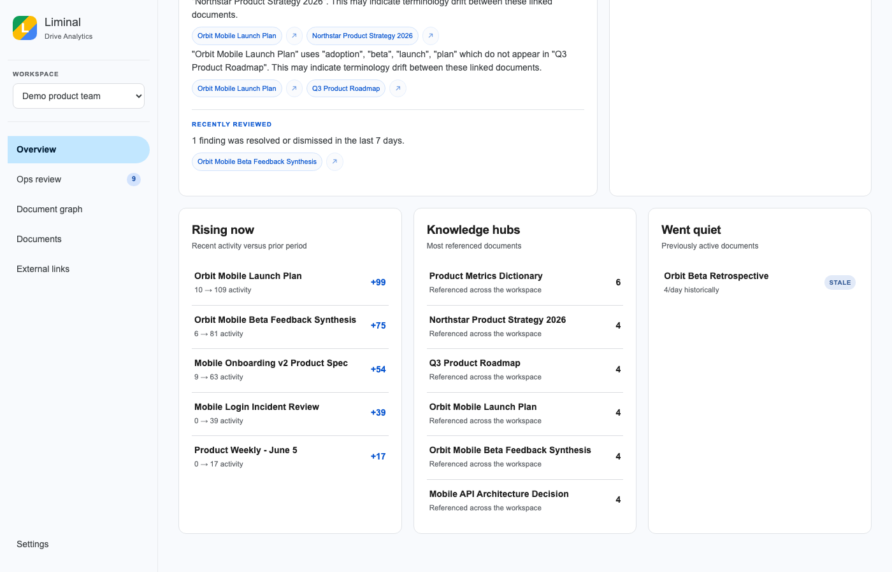
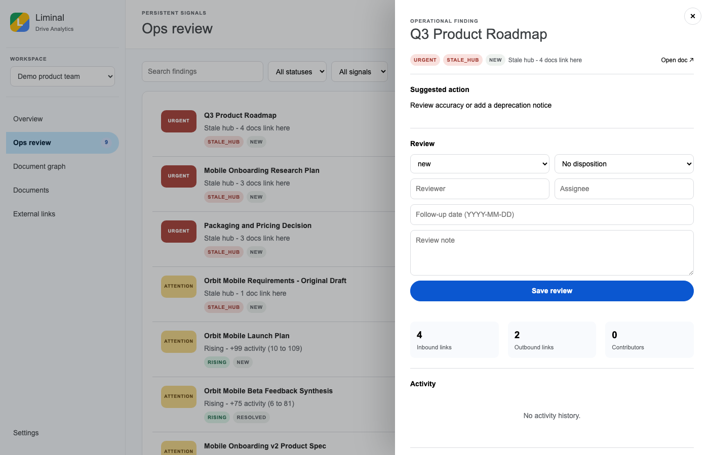

# Liminal Drive Analytics

> A graph-based analytics tool for Google Drive that gives operations leaders a pulse on their organization's knowledge — what's rising, what's stale, what's central, and how terminology is drifting across linked documents.

[](https://github.com/chrizbo/liminal-drive-analytics)

### Who It's For

Operations people and leaders who want to understand how organizational knowledge actually flows — not just who owns what, but what's being used, what's trusted, and what's drifting.

### Philosophy

This project is an extension of the Living Documents concept from [Agentics Beyond Code](https://github.com/chrizbo/agentics-beyond-code): documents aren't static artifacts, they're living signals of organizational activity. By connecting them into a graph and tracking how that graph changes over time, you get a dynamic picture of what the org knows, values, and is actively working on.

## Screenshots

| Overview with Leader Brief | Terminology Drift in Brief |
|---|---|
|  |  |

| Ops Review | Ops Review Panel |
|---|---|
|  |  |

| Document Graph | Document Detail with Concept Alignment |
|---|---|
|  |  |

## What It Does

Liminal Drive Analytics builds a live graph of your organization's documents and the connections between them — links, activity, authorship — and surfaces patterns that are invisible when you look at documents one at a time.

### Core Analytics

**Rising documents** — docs whose activity (edits, comments, views) is accelerating. Early signal for emerging projects, shifting priorities, or new initiatives gaining traction.

**Stale documents** — docs that were once heavily linked or active but have gone quiet. Candidates for archiving, updating, or flagging as outdated before someone acts on wrong information.

**Key/hub documents** — docs with high in-degree (many other docs link to them). These are the navigation hubs of your knowledge base: onboarding docs, policy references, canonical specs. Losing or corrupting one has outsized impact.

**External link map** — every link out of Google Docs to external systems (Notion, Jira, GitHub, Confluence, etc.) becomes a typed node in the graph. Surfaces what knowledge lives outside Drive and in what proportions.

**Leader Brief** — an actionable summary built from operational findings. Use **Viewing as** to see rising documents that person may not have viewed, then open the source documents directly. Document links in the brief open the document detail drawer inline. When Drive does not provide attributable viewer activity, the brief clearly falls back to broadly useful recommendations.

**Terminology Drift** — the Leader Brief flags linked document pairs where terminology diverges: documents that use different words for the same concepts. Detected deterministically (no LLM required) using term frequency analysis and Jaccard similarity across linked doc pairs. Inspired by the [Getting the Words Right](https://dotwork.com/getting-the-words-right) playbook on representation drift in organizations. See [docs/ontology-roadmap.md](docs/ontology-roadmap.md) for the phased plan toward LLM-enhanced semantic alignment.

**Ops Review** — a durable review queue for stale hubs, rising documents, and documents that went quiet. Three urgency levels replace opaque numeric scores. Click a finding title to open its review panel, which includes the suggested action, review form, document metrics, activity timeline, link graph, and concept alignment — all in one place. Reviewers can assign, annotate, resolve, dismiss, and schedule follow-up without modifying source documents.

**Background indexing** — request a fresh index from **Settings** and follow its active phase, current document, and progress without leaving the web app.

**Local settings** — configure the OpenAI model and path-significant external-link domains from the web app. Settings are persisted to `config.json`.

## Project Structure

```
drive-analytics/
├── README.md               # This file
├── SPEC.md                 # Technical specification and data model
├── FUTURE_IDEAS.md         # Tabled ideas for later consideration
├── docs/
│   ├── google-setup.md     # How to configure Google APIs and OAuth
│   ├── ontology-roadmap.md # Phased plan for terminology/semantic alignment
│   └── screenshots/        # Current web app screenshots
├── src/
│   ├── api.py              # FastAPI app and web/API routes
│   ├── auth.py             # OAuth flow and Google service clients
│   ├── indexer.py          # Drive crawling, activity, and link extraction
│   ├── graph.py            # Graph construction and analysis
│   ├── analytics.py        # Rising/stale/hub detection
│   ├── ontology.py         # Term extraction and alignment scoring
│   └── operations.py       # Leader Brief and Ops Review state
├── web/
│   ├── index.html          # Local web app shell
│   ├── app.js              # Views, drawers, and interactions
│   └── styles.css          # Google Drive-inspired interface
├── tests/                  # API, indexing, graph, and analytics tests
└── data/                  # Local graph storage (gitignored)
```

## Getting Started

### 1. Google API setup
Follow [docs/google-setup.md](docs/google-setup.md) to create a Google Cloud project, enable the required APIs, and download `credentials.json`.

### 2. Install dependencies
```bash
pip3 install -r requirements.txt
```

### 3. Configure
```bash
cp config.example.json config.json
# Edit config.json to add domain-specific settings for your org
```

Optional environment variables:

```bash
export OPENAI_API_KEY=...                 # enables Leader Brief polishing
export DRIVE_ANALYTICS_WRITE_TOKEN=...   # protects FastAPI POST/PATCH endpoints
export DRIVE_ANALYTICS_CORS_ORIGINS=http://localhost:3000
```

### 4. Authenticate
```bash
python3 src/auth.py --verify
```

### 5. Index your Drive
```bash
python3 src/indexer.py --days 90 --expand
```

To index a particular Shared Drive into its own selectable workspace, pass its
root URL, ID, or any folder URL inside it:

```bash
python3 src/indexer.py --shared-drive "https://drive.google.com/drive/folders/0AP6VPalWOTU-Uk9PVA" --days 365 --expand
```

Indexed Shared Drives appear by name in the web app's Workspace selector. Their
documents and operational findings remain isolated from personal Drive data.

### 6. Launch the web app
```bash
uvicorn src.api:app --reload
```

Open [http://127.0.0.1:8000](http://127.0.0.1:8000). The locally hosted web app opens in **Demo product team** mode by default. It includes the leader brief, analytics, urgency-based ops review, interactive document graph, document detail, external-link map, and settings. Switch to **Live Drive** or an indexed Shared Drive from the workspace selector.

Open **Settings** and use **Index Drive** to request a fresh index for the selected Live or Shared Drive workspace. The progress screen reports the active phase, current document, and completion while the background job runs locally.

Reset or prepare the demo dataset from the command line:

```bash
python3 src/demo_data.py
```

### Running tests
```bash
python3 -m pytest
```

Interactive API documentation is available at [http://127.0.0.1:8000/docs](http://127.0.0.1:8000/docs) while the app is running.

When `DRIVE_ANALYTICS_WRITE_TOKEN` is configured, operational writes require it in the `X-Admin-Token` header. Without a configured token, writes remain available for local use; set one before exposing the app beyond your machine.

## Hosting

- **Local** (default) — FastAPI serves the web app, API, and background indexer on your machine. Good for prototyping and personal Drive testing.
- **Google Cloud** (production path) — Cloud Run for the web app, API, and indexer; Cloud Scheduler for periodic scans; Firestore or BigQuery for graph storage. Designed to migrate cleanly from local.

See [SPEC.md](SPEC.md) for the full technical plan.
