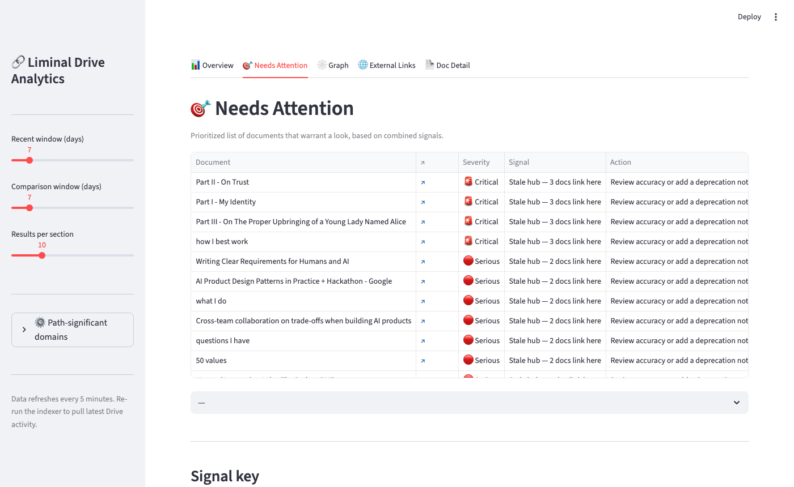
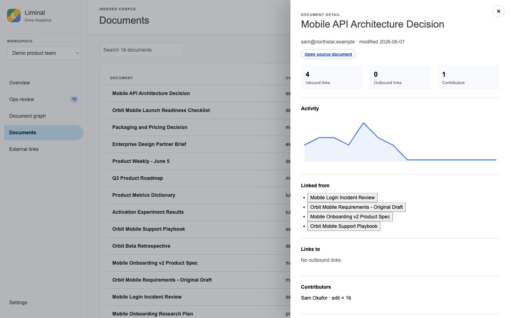

# Liminal Drive Analytics

> A graph-based analytics tool for Google Drive that gives operations leaders a pulse on their organization's knowledge — what's rising, what's stale, what's central, and how terminology is evolving.

[](https://github.com/chrizbo/liminal-drive-analytics)

## Screenshots

| Overview | Needs Attention |
|---|---|
|  |  |

| Document Graph | Doc Detail |
|---|---|
|  |  |

## What It Does

Liminal Drive Analytics builds a live graph of your organization's documents and the connections between them — links, activity, authorship — and surfaces patterns that are invisible when you look at documents one at a time.

### Core Analytics

**Rising documents** — docs whose activity (edits, comments, views) is accelerating. Early signal for emerging projects, shifting priorities, or new initiatives gaining traction.

**Stale documents** — docs that were once heavily linked or active but have gone quiet. Candidates for archiving, updating, or flagging as outdated before someone acts on wrong information.

**Key/hub documents** — docs with high in-degree (many other docs link to them). These are the navigation hubs of your knowledge base: onboarding docs, policy references, canonical specs. Losing or corrupting one has outsized impact.

**External link map** — every link out of Google Docs to external systems (Notion, Jira, GitHub, Confluence, etc.) becomes a typed node in the graph. Surfaces what knowledge lives outside Drive and in what proportions.

**Ontology tracking** — common terminology extracted from document content over time. Tracks which terms are rising, declining, or inconsistently defined across the org.

### Who It's For

Operations people and leaders who want to understand how organizational knowledge actually flows — not just who owns what, but what's being used, what's trusted, and what's drifting.

## Philosophy

This project is an extension of the Living Documents concept from [Agentics Beyond Code](https://github.com/chrizbo/agentics-beyond-code): documents aren't static artifacts, they're living signals of organizational activity. By connecting them into a graph and tracking how that graph changes over time, you get a dynamic picture of what the org knows, values, and is actively working on.

## Project Structure

```
drive-analytics/
├── README.md               # This file
├── SPEC.md                 # Technical specification and data model
├── FUTURE_IDEAS.md         # Tabled ideas for later consideration
├── docs/
│   └── google-setup.md    # How to configure Google APIs and OAuth
├── src/
│   ├── auth.py            # OAuth flow
│   ├── indexer.py         # Drive/Docs API crawling and link extraction
│   ├── graph.py           # Graph construction and analysis
│   └── analytics.py       # Rising/stale/hub detection
└── data/                  # Local graph storage (gitignored)
```

## Getting Started

### 1. Google API setup
Follow [docs/google-setup.md](docs/google-setup.md) to create a Google Cloud project, enable the required APIs, and download `credentials.json`.

### 2. Install dependencies
```bash
pip3 install -r requirements.txt
```

### 3. Configure
```bash
cp config.example.json config.json
# Edit config.json to add domain-specific settings for your org
```

### 4. Authenticate
```bash
python3 src/auth.py --verify
```

### 5. Index your Drive
```bash
python3 src/indexer.py --days 90 --expand
```

### 6. Launch the dashboard
```bash
streamlit run src/dashboard.py
```

### Running tests
```bash
python3 -m pytest
```

## Hosting

- **Local** (default) — runs as a Python script on your machine. Good for prototyping and personal Drive testing.
- **Google Cloud** (production path) — Cloud Run for the indexer and API, Cloud Scheduler for periodic scans, Firestore or BigQuery for graph storage. Designed to migrate cleanly from local.

See [SPEC.md](SPEC.md) for the full technical plan.
