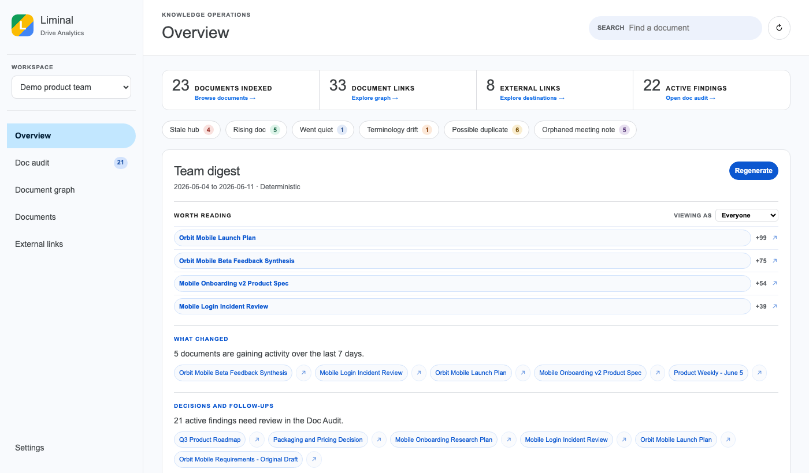
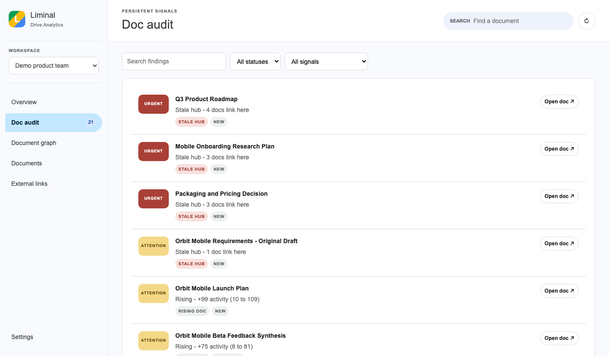
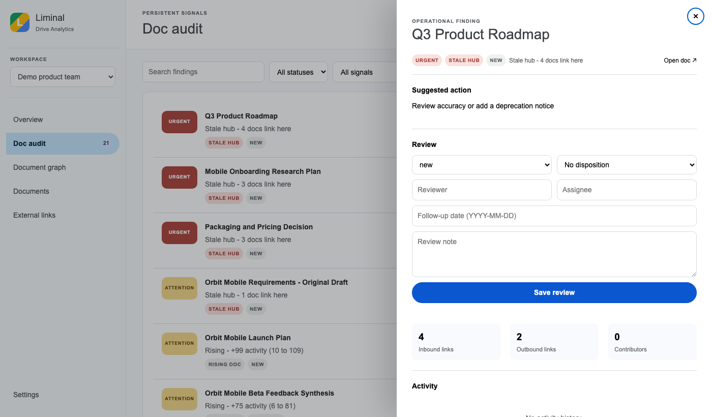
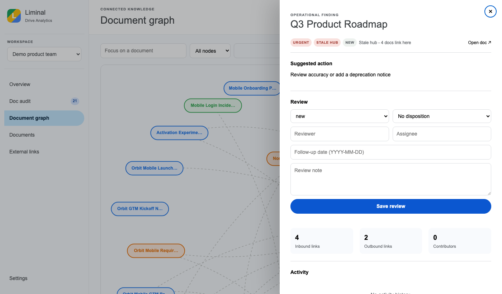

# Liminal Drive Analytics

> Your team's Google Drive has more to say than anyone's reading. Liminal surfaces what's rising, what's stale, what's drifting, and what needs attention — without anyone having to go looking.

[](https://github.com/chrizbo/liminal-drive-analytics)

## The Problem

Team knowledge lives in Google Drive, but Drive was built for storage — not insight. You can't easily answer: *What docs is the team actually relying on? Which specs are outdated but still being linked? Are two teams using different words for the same thing?* You find out the hard way, when someone acts on stale information or two workstreams collide.

Liminal connects your documents into a graph and watches how that graph changes over time. It answers the questions Drive doesn't.

## Who It's For

- **Team leads and PMs** who want a weekly pulse on what the team is reading, what's changed, and what to flag — without wading through Drive activity logs.
- **Ops leads, TPMs, and Chiefs of Staff** who need a durable queue of knowledge health issues to work through: stale hubs, orphaned notes, duplicate specs, and terminology that's diverged across teams.

## Screenshots

| Overview with Team Digest | Doc Audit queue |
|---|---|
|  |  |

| Doc Audit detail panel | Document graph |
|---|---|
|  |  |

## What It Does

### Team Digest

The Overview page gives anyone on the team an at-a-glance picture of what's happening in the knowledge base this week:

- **Worth reading** — the docs gaining the most activity, personalized by role
- **What changed** — which docs are newly rising and why
- **Decisions and follow-ups** — a plain-language summary of what needs attention, with direct links into the Doc Audit for action

Signal chips at the top show active finding counts by type — click any chip to jump straight to that filter in the Doc Audit.

### Doc Audit

A durable task queue for whoever owns knowledge health on the team. Each finding has a severity level, a suggested action, and a full review panel:

- **Stale hubs** — documents with many inbound links that have gone quiet; high blast radius if they're wrong
- **Rising docs** — newly active documents that may need freshness or owner review
- **Went quiet** — docs that lost activity after a period of engagement
- **Terminology drift** — linked document pairs using different words for the same concepts, detected automatically without an LLM
- **Possible duplicates** — document pairs with overlapping content and similar titles
- **Orphaned meeting notes** — meeting docs that were never linked into the broader knowledge base

Click any row to open the full review panel: suggested action, status and disposition tracking, assignee, follow-up date, document metrics, and activity timeline — all without leaving the page.

### Document Graph

An interactive graph of every document and the links between them. Filter by node type, focus on a single document to see its neighborhood, or enable alignment mode to spot terminology divergence visually. Hub documents (high inbound-link count) are highlighted — these are the load-bearing docs in your knowledge base.

### Background Indexing

Trigger a fresh index from Settings. Watch active phase, current document, and progress live without leaving the web app. Supports personal Drive and Shared Drives; each Shared Drive gets its own isolated workspace in the selector.

## Philosophy

This project is an extension of the Living Documents concept from [Agentics Beyond Code](https://github.com/chrizbo/agentics-beyond-code): documents aren't static artifacts, they're living signals of organizational activity. By connecting them into a graph and tracking how that graph changes over time, you get a dynamic picture of what the org knows, values, and is actively working on.

Terminology drift detection is inspired by the [Getting the Words Right](https://dotwork.com/getting-the-words-right) playbook on representation drift in organizations. See [docs/ontology-roadmap.md](docs/ontology-roadmap.md) for the phased plan toward LLM-enhanced semantic alignment.

## Project Structure

```
drive-analytics/
├── README.md               # This file
├── SPEC.md                 # Technical specification and data model
├── FUTURE_IDEAS.md         # Tabled ideas for later consideration
├── docs/
│   ├── google-setup.md     # How to configure Google APIs and OAuth
│   ├── ontology-roadmap.md # Phased plan for terminology/semantic alignment
│   └── screenshots/        # Current web app screenshots
├── src/
│   ├── api.py              # FastAPI app and web/API routes
│   ├── auth.py             # OAuth flow and Google service clients
│   ├── indexer.py          # Drive crawling, activity, and link extraction
│   ├── graph.py            # Graph construction and analysis
│   ├── analytics.py        # Rising/stale/hub detection
│   ├── ontology.py         # Term extraction and alignment scoring
│   └── operations.py       # Team Digest and Doc Audit state
├── web/
│   ├── index.html          # Local web app shell
│   ├── app.js              # Views, drawers, and interactions
│   └── styles.css          # Google Drive-inspired interface
├── tests/                  # API, indexing, graph, and analytics tests
└── data/                   # Local graph storage (gitignored)
```

## Getting Started

### 1. Google API setup
Follow [docs/google-setup.md](docs/google-setup.md) to create a Google Cloud project, enable the required APIs, and download `credentials.json`.

### 2. Install dependencies
```bash
pip3 install -r requirements.txt
```

### 3. Configure
```bash
cp config.example.json config.json
# Edit config.json to add domain-specific settings for your org
```

Optional environment variables:

```bash
export OPENAI_API_KEY=...                 # enables brief polishing
export DRIVE_ANALYTICS_WRITE_TOKEN=...   # protects FastAPI POST/PATCH endpoints
export DRIVE_ANALYTICS_CORS_ORIGINS=http://localhost:3000
```

### 4. Authenticate
```bash
python3 src/auth.py --verify
```

### 5. Index your Drive
```bash
python3 src/indexer.py --days 90 --expand
```

To index a particular Shared Drive into its own selectable workspace:

```bash
python3 src/indexer.py --shared-drive "https://drive.google.com/drive/folders/0AP6VPalWOTU-Uk9PVA" --days 365 --expand
```

### 6. Launch the web app
```bash
uvicorn src.api:app --reload
```

Open [http://127.0.0.1:8000](http://127.0.0.1:8000). The app opens in **Demo product team** mode by default. Switch to **Live Drive** or an indexed Shared Drive from the workspace selector.

Reset or prepare the demo dataset:

```bash
python3 src/demo_data.py
```

### Running tests
```bash
python3 -m pytest
```

Interactive API documentation: [http://127.0.0.1:8000/docs](http://127.0.0.1:8000/docs)

When `DRIVE_ANALYTICS_WRITE_TOKEN` is configured, operational writes require it in the `X-Admin-Token` header.

## Hosting

- **Local** (default) — FastAPI serves the web app, API, and background indexer on your machine. Good for prototyping and personal Drive testing.
- **Google Cloud** (production path) — Cloud Run for the web app, API, and indexer; Cloud Scheduler for periodic scans; Firestore or BigQuery for graph storage. Designed to migrate cleanly from local.

See [SPEC.md](SPEC.md) for the full technical plan.
